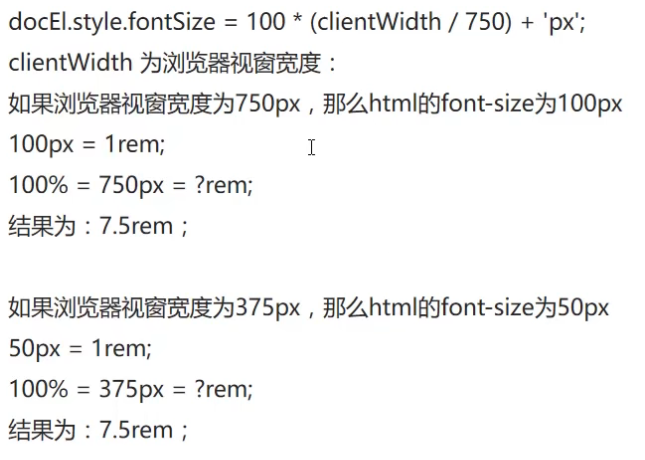

(_css3 新特性_)

## 响应式布局

### 媒体查询

浏览器窗口符合一定条件实现某些样式

```css
@media screen and (*: *) and (*: *) ... {
  selector {
  }
}
```

> 利弊
> 优点：一套页面适应多端设备，提升开发效率
> 缺点：页面效果不如单独为一终端定制的页面；性能问题；维护成本高
> 总结：大部分项目不会整体采用响应式

## 移动端单位

百分比法(_过于繁琐_)
px 像素；绝对单位
em 相对单位；父级元素`font-size:`值的倍数
rem 相对单位；`<html>`标签`font-size:`值的倍数；

> 用 js 设置
> 设计稿像素除以基数


