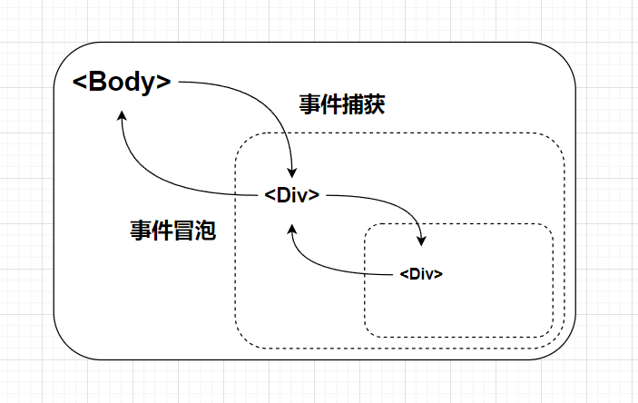

## DOM 基础

操作 html 元素的标准编程接口

### 获取 dom（元素/节点）

`document` 对象

元素形式(_尽量弃用_)

- `document.getElementById(" * ")`
- `document.getElementByClassName(" * ")` 集合

**选择器形式**(_尽量使用，性能更好_)

- `document.querySelector(" * ")` 只返回第一个
- `document.querySelectorAll(" * ")` 多选

可填入 `#`id `.`className 或网页标签

### 属性设置

- `*.style.css样式(驼峰命名)` 直接设置样式
- `*.src` 设置内容路径
- `*.id` 设置 id
- `*.className` 设置类名(_通常用来改变 css 样式_)

> `inp.value` 输入组件的内容

### `*.innerHTML`

设置网页元素内**所有**html 内容

```js
*.innerHTML = `
    //html内容
`
```

### 节点操作

创建元素节点：`document.createElement("网页元素")`
创建文本节点：`document.createTextNode("文本")`
添加节点：`*.appendChild(*)`
删除节点：`*.removeChild(*)`

## 事件

### 事件监听

监听事件(_多个同样事件会被覆盖，冒泡阶段触发_) `*.on+事件类型`

> `*.onclick` 点击
> `*.onmouseenter` 鼠标移入
> `*.onmouseleave` 鼠标移出
> `*.onmousemove` 鼠标移动

```js
事件 = function () {};
```

### 事件对象

`event` 作为形参放在事件函数内
`事件 = function (event) {};`

> 由于是形参所以可以任意改名，一般简写作`e`

- `e.clientX` 鼠标点击时的 x 坐标
- `e.clientY` 鼠标点击时的 y 坐标

### 事件绑定

可以同时绑定多个函数(_不会被覆盖_)，便于添加功能；可设置在捕获阶段触发

```js
*.addEventListener("事件类型", function () {

}, true/false(_默认，一般不写_))
```

### 事件流



- `false` 绑定事件默认为冒泡阶段触发(_从内到外_)
- `true` 改为捕获阶段触发

**阻止继续冒泡，避免重复触发外层事件** `e.stopPropagation();`
**取消 html 元素默认行为** `e.preventDefault();`/`return false;`

### 事件委托

根据事件的捕获和冒泡顺序，在父级元素下通过 `e.target`(_选中子级_)，将子元素的事件委托给父级处理

### 事件类型

- 鼠标事件
- 键盘事件
  - `keydown` 按下键盘
- 触屏事件
  - `touchstart` 触摸开始
  - `touchend` 触摸抬起
  - `touchmove` 按住滑动

> `e.keyCode` 键盘按键的键码
