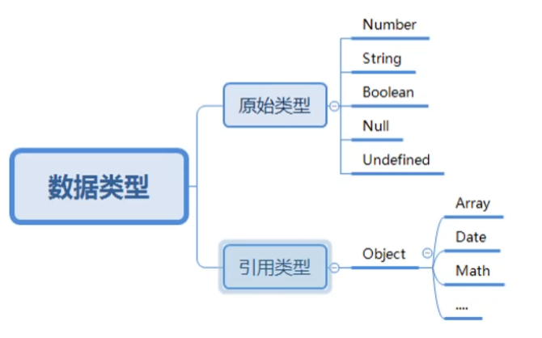

## 原始类型与引用类型



### 赋值区别

- 引用类型会随着被引用的属性的改变而改变

### 比较区别

- 原始类型只比较值
- 引用类型比较指向的内存空间；所以值相同却不指向同一个对象，则不等

### 传参区别

- 原始类型内部作用域的值不影响外部
- 引用类型外部会受到影响，因为内部作用域操作了其引用空间

### 类型检测

- `typeof(原始类型)` (_`null`，`引用类型`全检测为`object`_)
- `变量 instanceof 类型` 引用类型检测**是否**在某一类型内

> `null` 为原始类型
> 所以对象都继承于 `object`

## 异步编程

不会因为某一操作的卡顿使整体卡顿

```js
// 假数据
let target = "hello world";
// 模拟延迟
function getData() {
  setTimeout(() => {
    return target;
  }, 500);
}
// 解法1：回调函数
function getData1(fn) {
  setTimeout(() => {
    fn(target);
  }, 3000);
}
getData1((x) => {
  console.log(x);
});
//解法2：promise ES6内置对象
let p = new Promise((resolve) => {
  setTimeout(() => {
    resolve(target);
  }, 500);
});
p.then((y) => {
  console.log(y);
});
//终极解法3：async函数
async function fun() {
  let z = await getData();
  console.log(z);
}
fun();
```
