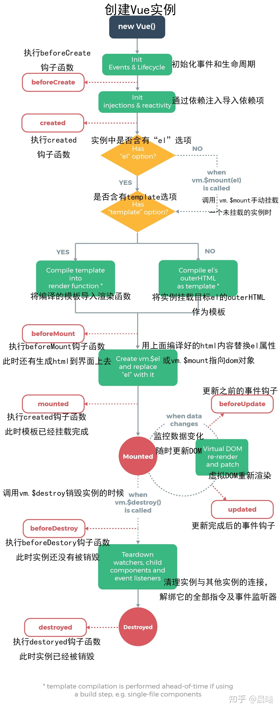
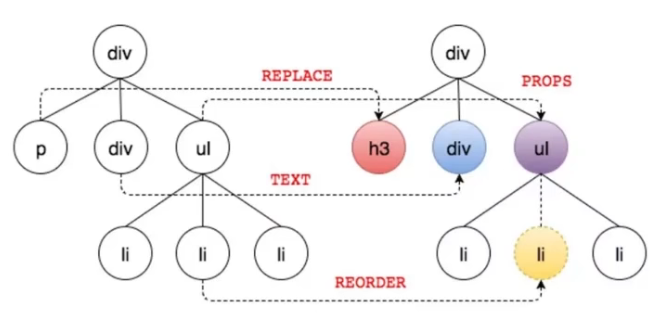

## 计算属性

多个值改变，影响一个结果时使用

```js
computed: {
  // 进行？纯计算？的属性
}
```

## 侦听器

一个值变化影响多个值时，使用侦听器

```js
watch:{
  x(val){
    // 绑定data中的值，当x的值发生变化时执行的函数
  }
}
```

## 生命周期钩子

> 不能使用箭头函数
> 为了避免杂乱，可以先在methods里写好方法，然后再在生命周期函数里调用

在页面加载时主动执行程序


```js
created(){
  // 一般用于初始化数据
}
// 加载 html 模板
mounted(){
  // 一般用于操作 html 元素
}
```

## 插槽

实现子级组件标签内自定义
让我们更灵活地使用自定义组件，增强组件的扩展性，组件库基本基于插槽

- 子级自定义组件：`<slot>待自定义部分</slot>`
- 父级 App.vue：`<...>自定义文本</...>`

**具名插槽**：

- 父级：`<app><template v-slot:1></template></app>`
- 子级：`<slot name="1"></slot>`

## 获取真实 DOM

`window.getComputedStyle(dom节点).样式属性`

- 用原生 js 获取 dom
  属性：`ref="*"` 其 dom 节点为：`this.$refs.*`

> Vue 应用开发的过程中，大部分情况是不需要获取真实 DOM 的
> Vue 中的数据变化，并不是直接改变 DOM，而是通过改变虚拟 DOM，并计算变更差异，进而修改 DOM 中有变化的内容，提升性能
> 

## 过滤器

通过固定算法重新组织数据 `{{str | split}}`

```js
filters:{
  split(str){
    return str.split("").join();
  }
}
```
